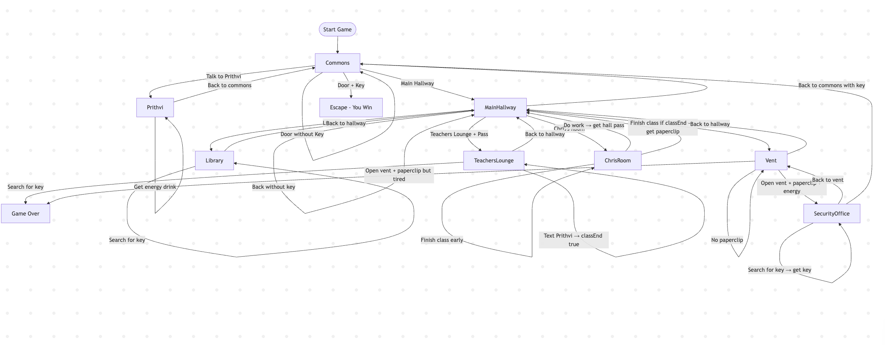

# Title -- The Great Hallway Escape

## Setting
The game takes place in the new building of Arlington Tech. The player starts in the commons, where students are hanging out between classes. From there, the player can go to different areas of the school such as the main hallway, library, lockers, and Chris’ room. The goal is to find a way to leave the building through the escape door without getting caught.

## Summory of the Story 
Your name is Tim and you're bored of going to school everyday, so being so fed up of school, you decided to escape. 

## Global variables:
* hasPaperClip - Keeps the track of whether the player has found the key or not. IT allows the player to open the vent.

* hasKey - Keeps the track of whether the player has the key. It Allows the player to unlock the exit door and escape.

* hasPass - Keeps the track of whether the player has the pass. Provides another way for the player to leave the school.

* energy - Tracks the player's energy level. Can increase when talking to Prithvi and is needed to be set at 1 inorder for the player to climb through the vent.

* classEnd - Keeps the track of whether the player did everything for the class end. If it's set at false, player can't advance to end the class which. 

## Additional layout: 
flowchart TD

Start([Start Game]) --> Commons

Commons -->|Talk to Prithvi| Prithvi
Commons -->|Main Hallway| MainHallway
Commons -->|Door + Key| Win[Escape - You Win]
Commons -->|Door without Key| Commons

Prithvi -->|Ask about key| Prithvi
Prithvi -->|Get energy drink| Prithvi
Prithvi -->|Back to commons| Commons

MainHallway -->|Library| Library
MainHallway -->|Chris's Room| ChrisRoom
MainHallway -->|Teachers Lounge + Pass| TeachersLounge
MainHallway -->|Teachers Lounge without Pass| MainHallway
MainHallway -->|Vent| Vent
MainHallway -->|Back to commons with key| Commons
MainHallway -->|Back without key| MainHallway

Library -->|Search for key| Library
Library -->|Back to hallway| MainHallway

ChrisRoom -->|Search for key| ChrisRoom
ChrisRoom -->|Do work → get hall pass| MainHallway
ChrisRoom -->|Finish class if classEnd → get paperclip| MainHallway
ChrisRoom -->|Finish class early| ChrisRoom

TeachersLounge -->|Back to hallway| MainHallway
TeachersLounge -->|Search for key| GameOver[Game Over]
TeachersLounge -->|Text Prithvi → classEnd true| TeachersLounge

Vent -->|Back to hallway| MainHallway
Vent -->|Open vent + paperclip + energy| SecurityOffice
Vent -->|Open vent + paperclip but tired| GameOver
Vent -->|No paperclip| Vent

SecurityOffice -->|Search for key → get key| SecurityOffice
SecurityOffice -->|Back to vent| Vent
SecurityOffice --> Commons